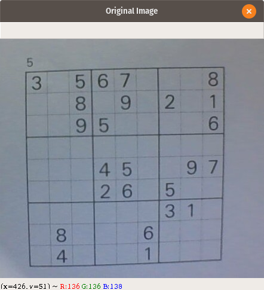
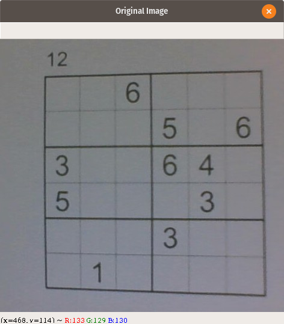
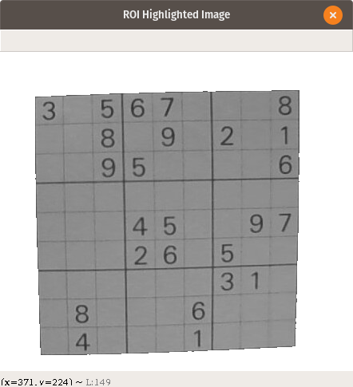
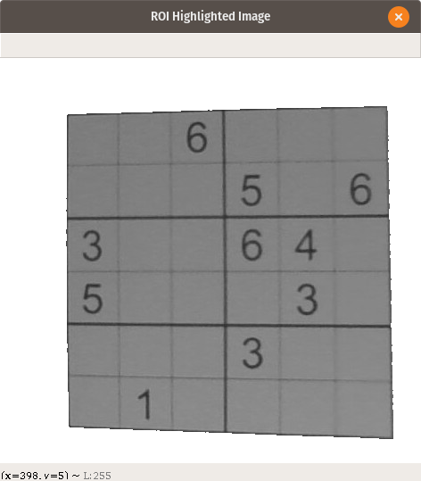
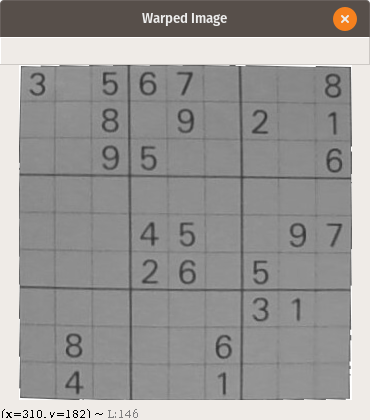
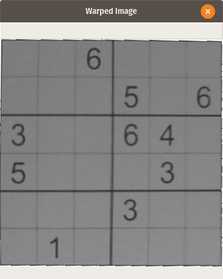
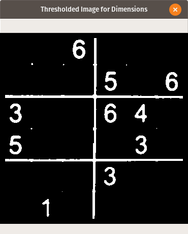

# Image Processing

## Original Image -

<p align="center">
	
	&nbsp;&nbsp;&nbsp;&nbsp;&nbsp;&nbsp;&nbsp;&nbsp;
	
</p>

## Region of Interest (ROI)	-

The method `get_grid` finds the largest contour, masks the area around the image with white pixel.

<b>Note:</b> The grid is only detected if the area of the largest contour is greater than 250<sup>2</sup>  pixel<sup>2</sup>.

<p align="center">
	
	&nbsp;&nbsp;&nbsp;&nbsp;&nbsp;&nbsp;&nbsp;&nbsp;
	
</p>

## Perspective Warping -

We notice that the ROI Image is slightly skewed and does not fit the complete image frame, i.e. the perspective of the screen is wrong. Ideally, we would want to have a top-down, birds-eye-view of the Puzzle.

The method `get_warped` utilize cv2.getPerspectiveTransform and cv2.warpPerspective to accomplish these transformations<sup>[\[1\]](#bibliography--)</sup>.

<p align="center">
	
	&nbsp;&nbsp;&nbsp;&nbsp;&nbsp;&nbsp;&nbsp;&nbsp;
	
</p>

## Extracting Dimensions -

For this task, we first threshold the image using Otsu’s Binarization<sup>[\[2\]](#bibliography--)</sup>. Post binarization, we are left with an image consisting of zeros and ones only. Now we apply simple matrix operations to deduce the sub grid dimension. See Example for a better understanding. 

<p align="center">
	
	&nbsp;&nbsp;&nbsp;&nbsp;&nbsp;&nbsp;&nbsp;&nbsp;
	
</p>

### Example -

Consider an image of 22x22 pixels post binarization as displayed below. Here, `⬛` means a pixel of value 0 and `⬜` means a pixel value of 1. 

```
⬛⬛⬛⬛⬛⬛⬜⬜⬛⬛⬛⬛⬛⬛⬜⬜⬛⬛⬛⬛⬛⬛
⬛⬜⬛⬛⬜⬛⬜⬜⬛⬜⬛⬛⬛⬛⬛⬜⬛⬛⬛⬛⬛⬛
⬛⬛⬜⬛⬜⬛⬜⬜⬛⬛⬛⬛⬛⬛⬜⬜⬛⬜⬛⬛⬛⬛
⬛⬛⬛⬛⬛⬛⬜⬛⬛⬛⬛⬜⬜⬛⬜⬛⬛⬛⬜⬛⬛⬛
⬜⬛⬜⬛⬛⬜⬜⬜⬛⬜⬛⬛⬛⬛⬜⬜⬛⬛⬛⬛⬛⬛
⬛⬛⬛⬛⬛⬛⬛⬜⬛⬛⬛⬛⬛⬛⬜⬜⬛⬛⬛⬛⬛⬛
⬜⬜⬜⬜⬜⬜⬜⬜⬜⬜⬜⬜⬛⬜⬜⬜⬜⬜⬜⬜⬜⬜
⬜⬜⬛⬜⬜⬜⬜⬛⬜⬜⬜⬜⬜⬜⬛⬜⬛⬜⬜⬛⬜⬜
⬛⬛⬛⬛⬛⬛⬜⬜⬛⬛⬛⬛⬛⬛⬜⬜⬛⬛⬛⬛⬛⬛
⬛⬛⬛⬛⬛⬛⬜⬜⬛⬛⬛⬛⬜⬛⬜⬜⬛⬛⬛⬛⬛⬛
⬛⬜⬛⬛⬛⬛⬜⬜⬛⬛⬜⬛⬛⬛⬜⬜⬛⬜⬛⬛⬛⬛
⬛⬛⬛⬛⬜⬛⬜⬜⬛⬛⬛⬛⬛⬛⬜⬛⬛⬛⬛⬜⬛⬛
⬛⬛⬛⬛⬛⬛⬛⬜⬛⬛⬛⬜⬛⬛⬜⬜⬛⬛⬛⬛⬛⬜
⬛⬛⬛⬛⬛⬛⬜⬜⬛⬛⬛⬛⬛⬛⬛⬜⬛⬛⬛⬛⬛⬛
⬜⬜⬜⬜⬜⬜⬜⬜⬜⬜⬛⬜⬜⬜⬜⬜⬜⬜⬜⬜⬜⬜
⬜⬜⬛⬜⬜⬜⬜⬛⬜⬜⬜⬜⬜⬜⬜⬜⬜⬜⬜⬜⬜⬜
⬛⬛⬛⬛⬛⬛⬜⬜⬛⬛⬛⬛⬛⬛⬜⬜⬛⬛⬛⬛⬛⬛
⬛⬜⬛⬛⬛⬛⬜⬜⬛⬜⬛⬛⬛⬛⬛⬜⬛⬛⬛⬛⬛⬜
⬛⬛⬛⬛⬜⬛⬜⬜⬛⬛⬛⬛⬛⬛⬜⬜⬛⬛⬛⬛⬛⬛
⬛⬛⬛⬛⬛⬜⬛⬜⬛⬛⬛⬜⬛⬛⬜⬛⬛⬜⬜⬛⬛⬛
⬛⬛⬛⬛⬛⬛⬜⬜⬛⬛⬛⬛⬛⬛⬜⬜⬛⬛⬛⬛⬛⬛
⬛⬛⬛⬛⬛⬛⬜⬜⬛⬛⬛⬛⬛⬛⬜⬜⬛⬛⬛⬛⬛⬛
```

The white pixels in each sub grid or the black pixels in the white grid lines can be treated as noise.
We then find the sum of the image matrix accross the vertical and the horizontal axis.

```
⬛  ⬛  ⬛  ⬛  ⬛  ⬛  ⬜  ⬜  ⬛  ⬛  ⬛  ⬛  ⬛  ⬛  ⬜  ⬜  ⬛  ⬛  ⬛  ⬛  ⬛  ⬛   4
⬛  ⬜  ⬛  ⬛  ⬜  ⬛  ⬜  ⬜  ⬛  ⬜  ⬛  ⬛  ⬛  ⬛  ⬛  ⬜  ⬛  ⬛  ⬛  ⬛  ⬛  ⬛   6 
⬛  ⬛  ⬜  ⬛  ⬜  ⬛  ⬜  ⬜  ⬛  ⬛  ⬛  ⬛  ⬛  ⬛  ⬜  ⬜  ⬛  ⬜  ⬛  ⬛  ⬛  ⬛   7		 
⬛  ⬛  ⬛  ⬛  ⬛  ⬛  ⬜  ⬛  ⬛  ⬛  ⬛  ⬜  ⬜  ⬛  ⬜  ⬛  ⬛  ⬛  ⬜  ⬛  ⬛  ⬛   5		H
⬜  ⬛  ⬜  ⬛  ⬛  ⬜  ⬜  ⬜  ⬛  ⬜  ⬛  ⬛  ⬛  ⬛  ⬜  ⬜  ⬛  ⬛  ⬛  ⬛  ⬛  ⬛   8		o 
⬛  ⬛  ⬛  ⬛  ⬛  ⬛  ⬛  ⬜  ⬛  ⬛  ⬛  ⬛  ⬛  ⬛  ⬜  ⬜  ⬛  ⬛  ⬛  ⬛  ⬛  ⬛   3		r
⬜  ⬜  ⬜  ⬜  ⬜  ⬜  ⬜  ⬜  ⬜  ⬜  ⬜  ⬜  ⬛  ⬜  ⬜  ⬜  ⬜  ⬜  ⬜  ⬜  ⬜  ⬜   21		i
⬜  ⬜  ⬛  ⬜  ⬜  ⬜  ⬜  ⬛  ⬜  ⬜  ⬜  ⬜  ⬜  ⬜  ⬛  ⬜  ⬛  ⬜  ⬜  ⬛  ⬜  ⬜   17		z  
⬛  ⬛  ⬛  ⬛  ⬛  ⬛  ⬜  ⬜  ⬛  ⬛  ⬛  ⬛  ⬛  ⬛  ⬜  ⬜  ⬛  ⬛  ⬛  ⬛  ⬛  ⬛   4		o 
⬛  ⬛  ⬛  ⬛  ⬛  ⬛  ⬜  ⬜  ⬛  ⬛  ⬛  ⬛  ⬜  ⬛  ⬜  ⬜  ⬛  ⬛  ⬛  ⬛  ⬛  ⬛   5		n 
⬛  ⬜  ⬛  ⬛  ⬛  ⬛  ⬜  ⬜  ⬛  ⬛  ⬜  ⬛  ⬛  ⬛  ⬜  ⬜  ⬛  ⬜  ⬛  ⬛  ⬛  ⬛   7		t
⬛  ⬛  ⬛  ⬛  ⬜  ⬛  ⬜  ⬜  ⬛  ⬛  ⬛  ⬛  ⬛  ⬛  ⬜  ⬛  ⬛  ⬛  ⬛  ⬜  ⬛  ⬛   5		a
⬛  ⬛  ⬛  ⬛  ⬛  ⬛  ⬛  ⬜  ⬛  ⬛  ⬛  ⬜  ⬛  ⬛  ⬜  ⬜  ⬛  ⬛  ⬛  ⬛  ⬛  ⬜   5		l
⬛  ⬛  ⬛  ⬛  ⬛  ⬛  ⬜  ⬜  ⬛  ⬛  ⬛  ⬛  ⬛  ⬛  ⬛  ⬜  ⬛  ⬛  ⬛  ⬛  ⬛  ⬛   3		 
⬜  ⬜  ⬜  ⬜  ⬜  ⬜  ⬜  ⬜  ⬜  ⬜  ⬛  ⬜  ⬜  ⬜  ⬜  ⬜  ⬜  ⬜  ⬜  ⬜  ⬜  ⬜   21		S
⬜  ⬜  ⬛  ⬜  ⬜  ⬜  ⬜  ⬛  ⬜  ⬜  ⬜  ⬜  ⬜  ⬜  ⬜  ⬜  ⬜  ⬜  ⬜  ⬜  ⬜  ⬜   20		u
⬛  ⬛  ⬛  ⬛  ⬛  ⬛  ⬜  ⬜  ⬛  ⬛  ⬛  ⬛  ⬛  ⬛  ⬜  ⬜  ⬛  ⬛  ⬛  ⬛  ⬛  ⬛   4		m
⬛  ⬜  ⬛  ⬛  ⬛  ⬛  ⬜  ⬜  ⬛  ⬜  ⬛  ⬛  ⬛  ⬛  ⬛  ⬜  ⬛  ⬛  ⬛  ⬛  ⬛  ⬜   6		
⬛  ⬛  ⬛  ⬛  ⬜  ⬛  ⬜  ⬜  ⬛  ⬛  ⬛  ⬛  ⬛  ⬛  ⬜  ⬜  ⬛  ⬛  ⬛  ⬛  ⬛  ⬛   5
⬛  ⬛  ⬛  ⬛  ⬛  ⬜  ⬛  ⬜  ⬛  ⬛  ⬛  ⬜  ⬛  ⬛  ⬜  ⬛  ⬛  ⬜  ⬜  ⬛  ⬛  ⬛   6
⬛  ⬛  ⬛  ⬛  ⬛  ⬛  ⬜  ⬜  ⬛  ⬛  ⬛  ⬛  ⬛  ⬛  ⬜  ⬜  ⬛  ⬛  ⬛  ⬛  ⬛  ⬛   4
⬛  ⬛  ⬛  ⬛  ⬛  ⬛  ⬜  ⬜  ⬛  ⬛  ⬛  ⬛  ⬛  ⬛  ⬜  ⬜  ⬛  ⬛  ⬛  ⬛  ⬛  ⬛   

5   7   4    4   8   6   19  19  4    7   4   7   5   4   18  19   3  7   6   4   4   6

				V e r t i c a l 	S u m 
```

The sum of the axises are then checked, if the value of any row or column sum is greater than 2/3<sup>rd</sup> the width or height respectively. Then in a new array, it is marked as 1, else 0.

```
Height of Image = 22
Width of Image = 22

66% of Height = 15
66% of Width = 15

Vertical Sum = [ 5, 7, 4, 4, 8, 6, 19, 19, 4, 7, 4, 7, 5, 4, 18, 19, 3, 7, 6, 4, 4, 6, 0]
Horizontal Sum = [ 4, 6, 7, 5, 8, 3, 21, 17, 4, 5, 7, 5, 5, 3, 21, 20, 4, 6, 5, 6, 4, 4] 

Vertical Bool = [0, 0, 0, 0, 0, 0, 1, 1, 0, 0, 0, 0, 0, 0, 1, 1, 0, 0, 0, 0, 0, 0, 0]
Horizontal Bool = [0, 0, 0, 0, 0, 0, 1, 1, 0, 0, 0, 0, 0, 0, 1, 1, 0, 0, 0, 0, 0, 0]

Total number of 0 to 1 Transitions in Vertical Bool = 2
Total number of 0 to 1 Transitions in Horizontal Bool = 2
```

From this information, we can derive the dimensions of the respective sudoku.

## Bibliography -

[1] [Perspective Warping](https://www.pyimagesearch.com/2014/05/05/building-pokedex-python-opencv-perspective-warping-step-5-6/).

[2] [Otsu’s Binarization](https://opencv-python-tutroals.readthedocs.io/en/latest/py_tutorials/py_imgproc/py_thresholding/py_thresholding.html)