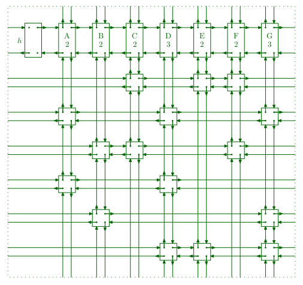

# Algorithm X using Dancing Links -

Algorithm X is an algorithm for solving the exact cover problem. It is a straightforward recursive, nondeterministic, depth-first, backtracking algorithm used by Donald Knuth to demonstrate an efficient implementation called DLX, which uses the dancing links technique.[<sup>[1]</sup>](./DancingLinks.pdf)

<b>Fun Fact</b>: <i>Algorithm X was named so due to lack of a better name.</i>

## Exact Cover Problem -

Given a collection S of subsets of a set X, an exact cover of X is a sub-collection S<sup>\*</sup> of S that satisfies two conditions -

-	The intersection of any two distinct subsets in S<sup>\*</sup> is empty.

-	The union of the subsets in S<sup>\*</sup> is X, i.e., the subsets in S<sup>\*</sup> cover X

### Algorithm (Psuedo Code) -

Let `A` represent the Matrix

```
If A is empty, the problem is solved; terminate successfully.
Otherwise choose a column, c (deterministically).
Choose a row, r, such that A[r, c] = 1 (nondeterministically).
Include r in the partial solution.
For each j such that A[r, j] = 1,
	delete column j from matrix A;
	for each i such that A[i, j] = 1,
		delete row i from matrix A.
Repeat this algorithm recursively on the reduced matrix A.
```

### Example -

Consider the exact cover problem specified by the universe U = {1, 2, 3, 4, 5, 6, 7} and the collection of sets S = {A, B, C, D, E, F}

-	A = {1, 4, 7};
-	B = {1, 4};
-	C = {4, 5, 7};
-	D = {3, 5, 6};
-	E = {2, 3, 6, 7};
-	F = {2, 7};

Thus, the rows correspond to the collection of sets and columns correspond to the elements of the universe.

#### Row Representation -

| ROW |    ELEMENTS  |
|:---:|:------------:|
|  A  |   {1, 4, 7}  |
|  B  |    {1, 4}    |
|  C  |   {4, 5, 7}  |
|  D  |   {3, 5, 6}  |
|  E  | {2, 3, 6, 7} |
|  F  |    {2, 7}    |

#### Column Representation -

| COLUMN |       ELEMENTS       |
|:------:|:--------------------:|
|    1   |      {'A', 'B'},     |
|    2   |      {'E', 'F'},     |
|    3   |      {'D', 'E'},     |
|    4   |   {'A', 'B', 'C'},   |
|    5   |      {'C', 'D'},     |
|    6   |      {'D', 'E'},     |
|    7   | {'A', 'C', 'E', 'F'} |

#### Matrix Representation -

The above rows and columns can be represented using a 6x7 incidence matrix -
	
|   | 1 | 2 | 3 | 4 | 5 | 6 | 7 |
|:-:|:-:|:-:|:-:|:-:|:-:|:-:|:-:|
| <b>A</b> | 1 | 0 | 0 | 1 | 0 | 0 | 1 |
| <b>B</b> | 1 | 0 | 0 | 1 | 0 | 0 | 0 |
| <b>C</b> | 0 | 0 | 0 | 1 | 1 | 0 | 1 |
| <b>D</b> | 0 | 0 | 1 | 0 | 1 | 1 | 0 |
| <b>E</b> | 0 | 1 | 1 | 0 | 0 | 1 | 1 |
| <b>F</b> | 0 | 1 | 0 | 0 | 0 | 0 | 1 |

#### Solution Approach -

-	Step 1:	(Level 0)
 	1.	Find the column with the minimun number ones.
 	2. 	In this case the column `1` has two ones. [i.e. the smallest index with the min. number of ones]
	3.	Add Row `A` to the solution.

		Partial Solution = [`A`]

	
	|   | 1 | 2 | 3 | 4 | 5 | 6 | 7 |
	|:-:|:-:|:-:|:-:|:-:|:-:|:-:|:-:|
	| <b>A</b> | <b>1</b> | 0 | 0 | 1 | 0 | 0 | 1 |
	| <b>B</b> | <b>1</b> | 0 | 0 | 1 | 0 | 0 | 0 |
	| <b>C</b> | 0 | 0 | 0 | 1 | 1 | 0 | 1 |
	| <b>D</b> | 0 | 0 | 1 | 0 | 1 | 1 | 0 |
	| <b>E</b> | 0 | 1 | 1 | 0 | 0 | 1 | 1 |
	| <b>F</b> | 0 | 1 | 0 | 0 | 0 | 0 | 1 |

-	Step 2: (Level 1)
	1.	In row `A` mark all the columns with ones.
	
	<br>

	|   | 1 | 2 | 3 | 4 | 5 | 6 | 7 |
	|:-:|:-:|:-:|:-:|:-:|:-:|:-:|:-:|
	| <b>A</b> | <b>1</b> | 0 | 0 | <b>1</b> | 0 | 0 | <b>1</b> |
	| <b>B</b> | <b>1</b> | 0 | 0 | <b>1</b> | 0 | 0 | 0 |
	| <b>C</b> | 0 | 0 | 0 | <b>1</b> | 1 | 0 | <b>1</b> |
	| <b>D</b> | 0 | 0 | 1 | 0 | 1 | 1 | 0 |
	| <b>E</b> | 0 | 1 | 1 | 0 | 0 | 1 | <b>1</b> |
	| <b>F</b> | 0 | 1 | 0 | 0 | 0 | 0 | <b>1</b> |

	2. Remove all the rows and columns containing a marked one.
	
	<br>

	|   | 2 | 3 | 5 | 6 |
	|:-:|:-:|:-:|:-:|:-:|
	| <b>D</b> | 0 | 1 | 1 | 1 |

-	Step 3: (Level 2)
	1. Repeat step 1.
	2. From Step 3-1., we add row `D` to the solution.

			Partial Solution = [`A`, `D`]

	3. But, the table is empty now and the solution does not generate a cover , this means we need to return to level 0.

-	Step 4:	(Level 0)
	1.	Remove `D` and `A` from the solution.
	2.	Continue from 13., Add `B` to the solution.

			Partial Solution = [`B`]


	|   | 1 | 2 | 3 | 4 | 5 | 6 | 7 |
	|:-:|:-:|:-:|:-:|:-:|:-:|:-:|:-:|
	| <b>A</b> | 1 | 0 | 0 | 1 | 0 | 0 | 1 |
	| <b>B</b> | <b>1</b> | 0 | 0 | <b>1</b> | 0 | 0 | 0 |
	| <b>C</b> | 0 | 0 | 0 | 1 | 1 | 0 | 1 |
	| <b>D</b> | 0 | 0 | 1 | 0 | 1 | 1 | 0 |
	| <b>E</b> | 0 | 1 | 1 | 0 | 0 | 1 | 1 |
	| <b>F</b> | 0 | 1 | 0 | 0 | 0 | 0 | 1 |

-	Step 5:	(Level 1)
	1. In row `B` mark all the columns with ones.
	
	<br>

	|   | 1 | 2 | 3 | 4 | 5 | 6 | 7 |
	|:-:|:-:|:-:|:-:|:-:|:-:|:-:|:-:|
	| <b>A</b> | <b>1</b> | 0 | 0 | <b>1</b> | 0 | 0 | 1 |
	| <b>B</b> | <b>1</b> | 0 | 0 | <b>1</b> | 0 | 0 | 0 |
	| <b>C</b> | 0 | 0 | 0 | <b>1</b> | 1 | 0 | 1 |
	| <b>D</b> | 0 | 0 | 1 | 0 | 1 | 1 | 0 |
	| <b>E</b> | 0 | 1 | 1 | 0 | 0 | 1 | 1 |
	| <b>F</b> | 0 | 1 | 0 | 0 | 0 | 0 | 1 |

	2.	Remove all the rows and columns containing a marked one.
	
	<br>

	|   | 2 | 3 | 5 | 6 | 7 |
	|:-:|:-:|:-:|:-:|:-:|:-:|
	| <b>D</b> | 0 | 1 | 1 | 1 | 0 |
	| <b>E</b> | 1 | 1 | 0 | 1 | 1 |
	| <b>F</b> | 1 | 0 | 0 | 0 | 1 |

-	Step 6:	(Level 1)
	1.	Repeat Step 1.
	2.	In this case the column `5` has a single one.
	3.	So we now add `D` to the solution.

			Partial Solution = [`B`, `D`]

-	Step 7:	(Level 2)
	1.	In row `D` mark all the columns with ones.
	
	<br>

	|   | 2 | 3 | 5 | 6 | 7 |
	|:-:|:-:|:-:|:-:|:-:|:-:|
	| <b>D</b> | 0 | <b>1</b> | <b>1</b> | <b>1</b> | 0 |
	| <b>E</b> | 1 | <b>1</b> | 0 | <b>1</b> | 1 |
	| <b>F</b> | 1 | 0 | 0 | 0 | 1 |

	2.	Remove all the rows and columns containing a marked one.
	
	<br>

	|   | 2 | 7 |
	|:-:|:-:|:-:|
	| <b>F</b> | 1 | 1 |

- 	Step 8: (Level 3)
	1. 	Repeat step 1.
	2.	From Step 8-1., we add row `F` to the solution.

			Partial Solution = [`B`, `D`, `F`]

	3.	Again, the table is empty, but now the solution generates a cover. So we end with this solution

##### Solution -
	
|   | 1 | 2 | 3 | 4 | 5 | 6 | 7 |
|:-:|:-:|:-:|:-:|:-:|:-:|:-:|:-:|
| <b>B</b> | 1 | 0 | 0 | 1 | 0 | 0 | 0 |
| <b>D</b> | 0 | 0 | 1 | 0 | 1 | 1 | 0 |
| <b>F</b> | 0 | 1 | 0 | 0 | 0 | 0 | 1 |

## Dancing Links -

Dancing links is a technique for reverting the operation of deleting a node from a circular doubly linked list. It is particularly useful for efficiently implementing backtracking algorithms.[<sup>[1]</sup>](./DancingLinks.pdf)

### Deleting a Node -

Consider, the case of deleting a node `x`, with the right pointer pointing to the node on right of `x` and similarly the left pointer pointing to the left node. the deletion can be performed by -

```
x.left.right ← x.right;
x.right.left ← x.left;
```

### Adding the Node -

The Node `x` can added back by implementing this -

```
x.left.right ← x;
x.right.left ← x;
```

### Dancing Steps -

One good way to implement algorithm X is to represent each 1 in the matrix A as a data object x with five fields L[x], R[x], U [x], D[x], C[x]. Rows of the matrix are doubly linked as circular lists via the L and R fields (“left” and “right”); columns are doubly linked as circular lists via the U and D fields (“up” and “down”). Each column
list also includes a special data object called its list header.[<sup>[1]</sup>](./DancingLinks.pdf)

<p align="center">
  
</p>

## Bibliography -

[1]	Knuth, Donald \(2000\). ["Dancing links"](https://arxiv.org/abs/cs/0011047)